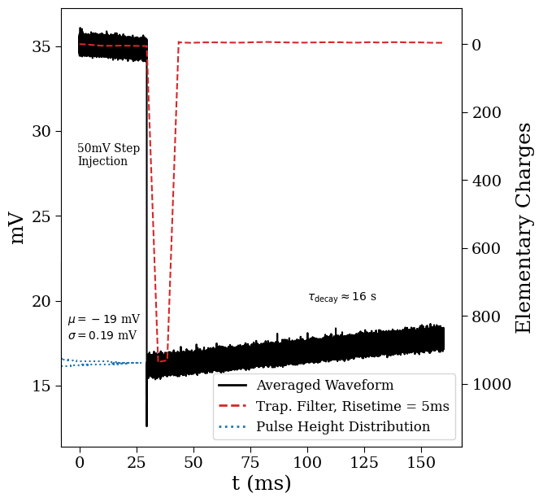
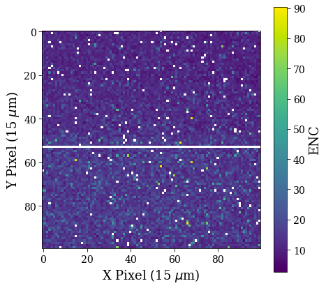
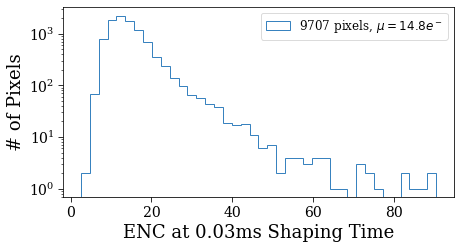
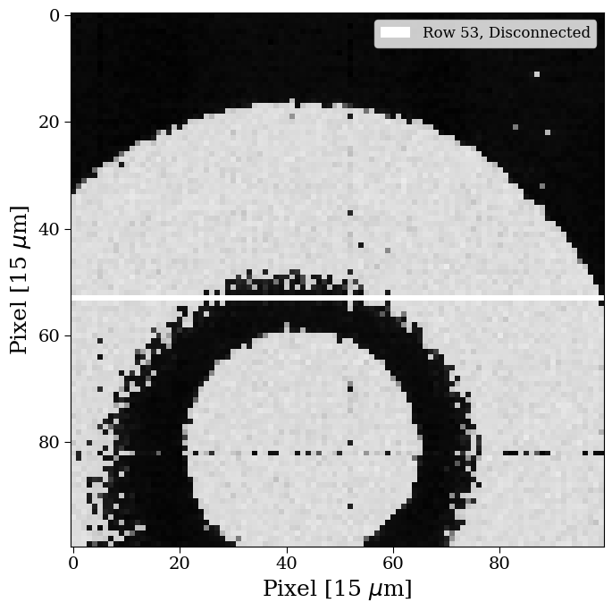
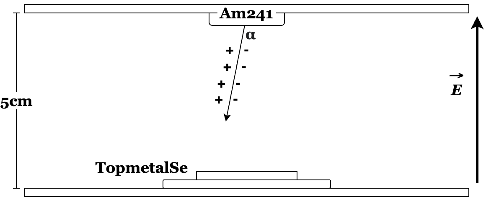
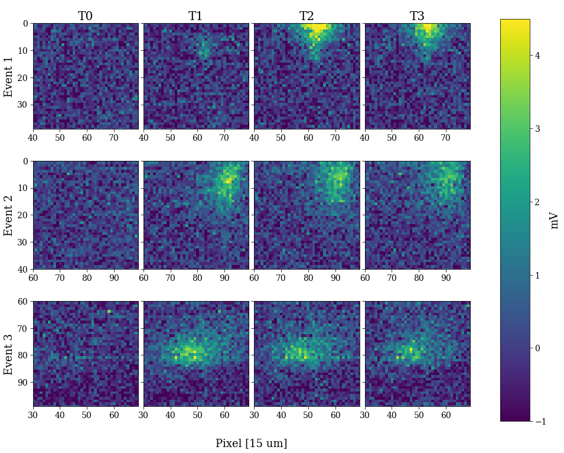

# TopMetalSe-OpenMPW6

  

---

## A Low Noise Charge Sensing Pixelated CMOS Detector for the Selena Neutrino Experiment

Tutorial
=================
The [tutorial is here](https://www.overleaf.com/read/tnfywwfnhdpv) . 

Overview
=================
[Skip To Results](#testing-results)

The TopMetalSe-MPW6 is a prototype charge sensing detector for the Selena Neutrino Experiment submitted to the OpenMPW-6 Shuttle Run. It is based on the [TopMetal-II -  Active Pixel Sensor](https://arxiv.org/abs/1509.08611), which we had previously characterized. A TopMetal pixel contains an electrode made from the topmost metal layer, surrounded by a guard ring (gring). Each pixel is directly coupled to a charge sensitive amplifier (CSA), which converts input charge to an analog signal. The TopMetalSe-MPW6 contains a 100x100 pixel array and a smaller 3x3 test structure in the user area. The pixels have a square geometry, with a 10.2 µm electrode with and a 15 µm pixel pitch. The simulated noise is ~10-15 electrons with a charge conversion gain of ~25 µV per electron.

The TopMetalSe will be implemented in the final detector design of the Selena neutrino experiment, which couples an amorphous selenium (aSe) ionization target to a CMOS pixel array as an imaging detector for next generation neutrino physics. The physics is detailed in the [White Paper here](https://arxiv.org/abs/2203.08779). In a nutshell, by coupling CMOS charge sensors directly to aSe, one can image electron tracks as they move through the detector. By measuing the energy, track geometry and timing of these electrons, we can look for unique nuclear decay patterns to probe the nature of neutrinos.

Details and Simulation
=================
**Pixel Geometry**

The Pixel Geometry is shown here. To meet DRC requirements, the gring is 1.6µm thick, shared between pixels (effective 0.8µm thick gring per pixel). In addition, the spacing between the gring and input electrode is 1.6µm. Parasitic extraction from Magic gives the capcitance between the gring and electrode as 3.1 femtofarads.

**Sensor Structure**

The core of each pixel is the charge sensitive amplifier, schematic shown above. It is formed using a dual-input cascode amplifier, a source-follower output stage and a feedback loop with a MiM capacitor and a transistor acting as a resistor. The gate-source voltage of the feedback resistor is determined by the difference between CSA_VREF and VREF and controls the decay constant of the CSA. Following the output of the CSA, there is two source follower stages, followed by a row selection transistor. Exterior to the pixel array output is the COL_SEL transistor.

During readout, we use two clock pulses and two shift registers to control the ROW_SEL and COL_SEL transistors, the latter being 100x slower than the ROW_SEL clock. This allows us fully multiplex the pixel outputs onto a single readout line. The output of the array is fed to an output buffer stage, formed from a previously submitted [open-source OpAmp](https://github.com/diegohernando/caravel_fulgor_opamp). 

We simulate a simple 3x3 pixel array, with the output of the chip shown below at a clock frequency of 1kHz. The positive pulses show the pixel switching, with the higher pulses being the column switching. At 65 milliseconds, we inject a a 6242 electron signal (100 pA for 10 microseconds) onto pixel 6.

**Array Control**
The large 100x100 pixel array is controlled by two shift registers, the behavioral code for which is [found here](https://github.com/plac-lab/TopmetalSe).
The control of the two shift registers is handled by an FPGA external to the device; the vivado for project can be [found here](https://github.com/harryxni/TopmetalSe_Sequencer).

# Testing Results
For the most, the "bring-up" of our chips was quite simple since our project did not interact at all with the Caravel core. 
We had our own PCB, which provided the bias voltages, the output amplifiers and the interface to our FPGA, which managed the clocking.
We tested with two different packages: the provided QFN and the bare die (which we wirebonded).

**Single Pixel Amplifiers**
The first step in testing our devices was to demonstrate that the in-pixel charge sensitive amplifiers were working. We injected charge into our amplifiers through the parasitic capacitance between the guard-ring and the input to our amplifiers. We began by doing this on one of the pixels within our small 3x3 array, which allowed us to not worry about pixel selection in the large array. 
I am showing an example output response from the amplifier.

After digitizing and saving the output pulse, we apply a trapezoidal filter and record the height of the output pulse. The distribution of pulse heights over multiple pulse injections gives us an idea of the noise and gain of our amplifiers.

Now, doing this over the entire ray gives an idea of the distribution of the noise over the area, shown in units of Equivalent Noise Charge.

**Optical Imaging with the Array**

With the in-pixel amplifiers working, the next step was demonstrating that we can actually take an image off of the array.
We did this by utilizing the fact that, although we did not design and instrument a photodiode within each pixel, we can stil use visible light to ionize charge within the silicon. This ionized charge should induce a current within our pixels, which can then be read out.

By taking an LED bike light and focusing that light with some optical lens, we took the following image:

(You might notice at this point that we are missing a row, which is due to the fact that I forgot to connect one of its connections).

**A "Time Projection Chamber in ambient air"**
Lastly, we wanted to show that the exposed metal electrodes were able to collect external charge and generate an image.
We did this by creating essentially a time projection chamber in ambient air. An alpha emitter was placed at the top of a high drift field. In ambient air, that alpha will travel <5cm and generate >100,000 ions. If we place our imager such as to avoid those alphas, we can image the tracks generated by the ion drift.

In this test, we took 4 consecutive frames per readout. I've selected out events for which we can see the arrival of ions at our array, which means that frame 0 shows no charge and frame 1 shows a cloud of ions. The frames were taken at a 2.5 MHz pixel clock (250 Hz frame rate), thus each frame is separated by 4ms.

