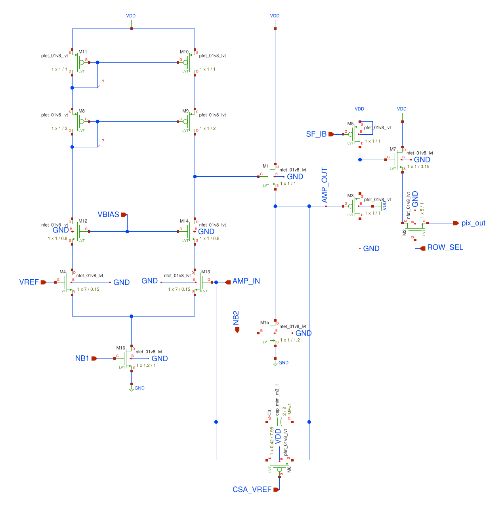
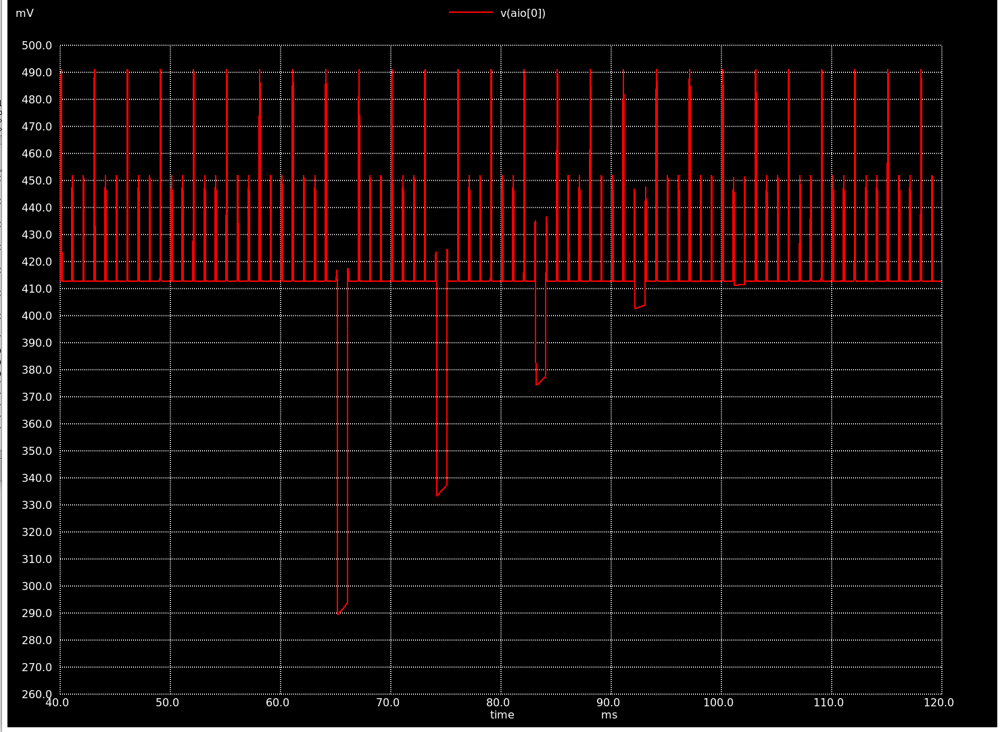

# TopMetalSe-OpenMPW6

  

---

## A Low Noise Charge Sensing Pixelated CMOS Detector for the Selena Neutrino Experiment

Tutorial
=================
The [tutorial is here](https://www.overleaf.com/read/tnfywwfnhdpv) . 

Overview
=================
[Skip To Results](#testing-results)

The TopMetalSe-MPW6 is a prototype charge sensing detector for the Selena Neutrino Experiment submitted to the OpenMPW-6 Shuttle Run. It is based on the [TopMetal-II -  Active Pixel Sensor](https://arxiv.org/abs/1509.08611), which we had previously characterized. A TopMetal pixel contains an electrode made from the topmost metal layer, surrounded by a guard ring (gring). Each pixel is directly coupled to a charge sensitive amplifier (CSA), which converts input charge to an analog signal. The TopMetalSe-MPW6 contains 2 100x100 pixel array test structures in each user area. The pixels have a square geometry, with a 10.2 µm electrode with and a 15 µm pixel pitch. The simulated noise is ~15 electrons with a charge conserion gain of ~25 µV per electron.

The TopMetaelSe will be implemented in the final detector design of the Selena neutrino experiment, which couples an amorphous selenium (aSe) ionization target to a CMOS pixel array as an imaging detector for next generation neutrino physics. The physics is detailed in the [White Paper here](https://arxiv.org/abs/2203.08779). In a nutshell, by coupling CMOS charge sensors directly to aSe, one can image electron tracks as they move through the detector. By measuing the energy, track geometry and timing of these electrons, we can look for unique nuclear decay patterns to probe the nature of neutrinos.

For the final design, the TopMetalSe will require an opening in the passivation layer in order to directly couple to aSe. But for the OpenMPW 6 run, we are unable to do so, and thus, this submission will be used as a test of the design and workflow. The stray capcitance between the surrounding gring and the electrode will allow us to inject charge and characterize the pixel performance in the absence of an external ionizaiton source.

Details and Simulation
=================
**Pixel Geometry**

The Pixel Geometry is shown here. To meet DRC requirements, the gring is 1.6µm thick, shared between pixels (effective 0.8µm thick gring per pixel). In addition, the spacing between the gring and input electrode is 1.6µm. Parasitic extraction from Magic gives the capcitance between the gring and electrode as 3.1 femtofarads.

**Sensor Structure**

The core of each pixel is the charge sensitive amplifier, schematic shown above. It is formed using a dual-input cascode amplifier, a source-follower output stage and a feedback loop with a MiM capacitor and a transistor acting as a resistor. The gate-source voltage of the feedback resistor is determined by the difference between CSA_VREF and VREF and controls the decay constant of the CSA. Following the output of the CSA, there is two source follower stages, followed by a row selection transistor. Exterior to the pixel array output is the COL_SEL transistor.

During readout, we use two clock pulses and two shift registers to control the ROW_SEL and COL_SEL transistors, the latter being 100x slower than the ROW_SEL clock. This allows us fully multiplex the pixel outputs onto a single readout line. The output of the array is fed to an output buffer stage, formed from a previously submitted [open-source OpAmp](https://github.com/diegohernando/caravel_fulgor_opamp). 

We simulate a simple 3x3 pixel array, with the output of the chip shown below at a clock frequency of 1kHz. The positive pulses show the pixel switching, with the higher pulses being the column switching. At 65 milliseconds, we inject a a 6242 electron signal (100 pA for 10 microseconds) onto pixel 6.

**Array Control**
The large 100x100 pixel array is controlled by two shift registers, the behavioral code for which is [found here](https://github.com/plac-lab/TopmetalSe).
The control of the two shift registers is handled by an FPGA external to the device; the vivado for project can be [found here](https://github.com/harryxni/TopmetalSe_Sequencer).

# Testing Results
For the most, the "bring-up" of our chips was quite simple since our project did not interact at all with the Caravel core. 
We had our own PCB, which provided the bias voltages, the output amplifiers and the interface to our FPGA, which managed the clocking.
We tested with two different packages: the provided QFN and the bare die (which we wirebonded).
**Single Pixel Amplifiers**
The first step in testing our deviceswas to demonstrate that the in-pixel charge sensitive amplifiers were working. 

**Optical Imaging with the Array**

**A "Time Projection Chamber in ambient air"**

